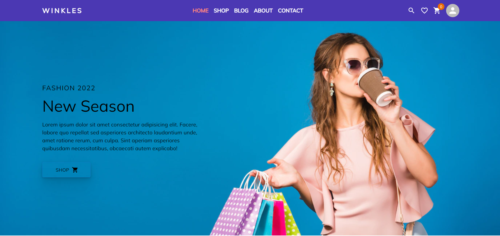

<h1 align='center'>
<a href='https://winkles.vercel.app/' target='_blank'>
Winkles</a>
</h1>

<b>E-commerce web-application of a Clothing Store</b>

### Client Side Link : [https://github.com/Tasnim-Pricila/Winkles-Clothing-Store](https://github.com/Tasnim-Pricila/Winkles-Clothing-Store)
### Backend Side Link : [https://github.com/Tasnim-Pricila/winkles-server-side](https://github.com/Tasnim-Pricila/winkles-server-side) 
### Website Live Link : [https://winkles.vercel.app/](https://winkles.vercel.app/) 

## **Project Description**
### **Tools and Technologies Used** :

* HTML
* CSS
* Material-UI
* React JS
* React Redux
* Stripe 
* Node Js
* Express Js
* MongoDB
* Mongoose
* JWT Token
* Vercel
* Render
### **About Project** :

1. This is a Single-Page-Application website of a clothing store.
2. Jwt token is used for login authentication.
3. Users can filter products on various types.
4. Users can wishlist any product.
5. Users can add products to cart.
6. Users can pay for the products via stripe they want to buy.
7. Users can view their order's status and their previous orders.
8. Users can add their reviews for the product.
9. Different dashboard routes for admin and users. 
10. Admin is able to create, update or delete any products.
11. Admin can see the products purchased by any users and update their order status.
12. Admin can delete the orders which are ordered by users but unpaid.
13. Users and admins both can see their profile on dashboard page.
14. Users can update their profile and display image.
15. Website is responsive for all screen sizes.

## Admin credentials

| **E-mail**                   | **Password**     |
| ---------------------------- | ---------------- |
| tasnimpricila27@gmail.com    | Tasnim123#       |

NOTE: These are just for testing purpose. 
Please Don't:

1. Update or delete any existing product, brand and categories.
2. Delete product reviews.
3. Delete or block any existing admin users.
4. Delete or edit any orders.

For testing, you can create a new product, order, brand and categories. Update or delete anything you created and try out the things.

(If you liked the project, give it a star 😃)

